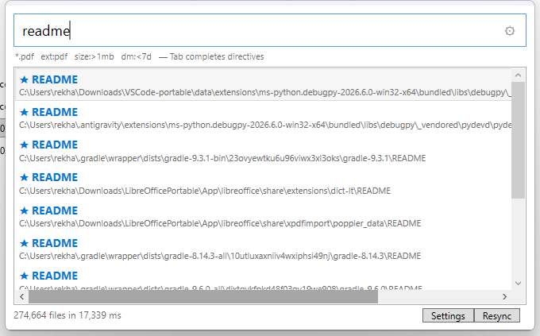

# win-fast-finder

[](https://github.com/maxico714/win-fast-finder/actions/workflows/ci.yml)
[](https://github.com/maxico714/win-fast-finder/releases)
[](LICENSE)
[](https://dotnet.microsoft.com/en-us/download/dotnet/8.0)

One hotkey. Instant offline filename search on Windows.

`win-fast-finder` finds files **by name only** — never their contents — using a
zero-dependency in-memory index. No Windows Search service, no cloud, no
telemetry, no admin rights.



*Real screenshot, captured from a live run via synthetic `SendInput` — see
[tests/e2e](tests/e2e).*

---

## Table of contents

- [Why](#why)
- [Requirements](#requirements)
- [Install](#install)
- [Quickstart](#quickstart)
- [Query syntax](#query-syntax)
- [Hotkeys](#hotkeys)
- [Settings](#settings)
- [Performance](#performance)
- [Privacy](#privacy)
- [Troubleshooting](#troubleshooting)
- [Build from source](#build-from-source)
- [Documentation](#documentation)
- [Contributing](#contributing)
- [Credits](#credits)
- [License](#license)

---

## Why

Windows Search is slow and can miss files. Popular alternatives are either
closed-source or paywalled. This project exists to answer one question with
**MIT-licensed, fully auditable code**: *where is that file?*

- **Fast** — queries are typically single-digit milliseconds over hundreds of
  thousands of cached names.
- **Offline & private** — zero network code. The app cannot phone home because
  it has no code that does.
- **Non-admin** — no kernel driver, no NTFS MFT reads, no services.
- **Small** — a ~240 KB app plus a single runtime prerequisite.
- **Honest** — every performance number below is reproducible from the README.

## Requirements

| | |
|---|---|
| OS | Windows 10 (1607+) or Windows 11, x64 |
| Runtime | **[.NET 8 Desktop Runtime](https://dotnet.microsoft.com/en-us/download/dotnet/8.0)** — get the *Desktop* Runtime, x64 |
| Disk | ~1 MB installed (plus the runtime if you don't have it) |
| Rights | None beyond a normal user account |

The installer checks for the runtime **before copying anything** and stops with
a download link if it is missing.

## Install

1. Download **`win-fast-finder-Setup-1.0.1.exe`** from
   [Releases](https://github.com/maxico714/win-fast-finder/releases).
2. Verify the checksum (optional but good practice):
   ```powershell
   Get-FileHash .\win-fast-finder-Setup-1.0.1.exe -Algorithm SHA256
   ```
   Compare against the `.sha256` file on the release page.
3. Run the installer. It elevates **once** (default `C:\Program Files`),
   checks the .NET runtime, installs, registers a Start Menu entry and an
   optional autostart item, and can launch the app immediately.
4. Press **Ctrl+Shift+F** and type.

> **SmartScreen / Defender note:** this installer is **not code-signed**
> (certificates cost money). Windows may show "Windows protected your PC" —
> click **More info → Run anyway**. This is expected and is stated plainly
> rather than hidden. See [SECURITY](SECURITY.md).

## Quickstart

```sh
# clone
git clone https://github.com/maxico714/win-fast-finder.git
cd win-fast-finder

# build and test
dotnet build Wff.sln --no-incremental
dotnet test tests/Wff.Tests/Wff.Tests.csproj

# GUI (no args)
dotnet run --project src/Wff.App
```

Then: **Ctrl+Shift+F** → type → **Enter** opens, **Esc** hides.

First run indexes your user profile only (fast). Add more roots in
**Settings** for full-drive search. The status line shows live progress —
never a silent hang.

## Query syntax

Free text plus optional directives. Tokens are separated by spaces;
directive names are case-insensitive.

| Syntax | Meaning | Example |
|---|---|---|
| `report` | Subsequence match on filenames (`report` matches `my **repo**rt.pdf`) | `invoice` |
| `*.pdf` | Glob (`*` any run, `?` one character) | `2024-*.xlsx` |
| `ext:pdf` | Extension filter (repeatable = OR); leading dot optional | `ext:pdf ext:docx` |
| `size:>10kb` | `>`, `<`, or bare for exact; units `b`/`kb`/`mb`/`gb` | `size:<2mb` |
| `dm:<7d` | Modified **within** the last 7 days; `dm:>30d` = older than 30 days; bare `dm:7d` = within 7 days | `dm:<30d` |
| `path:` | Match against the full path, not just the filename | `path:Downloads` |

Combine freely:

```
rep* ext:pdf size:>10kb dm:<30d path:projects
```

- **Tab** completes directive prefixes at the end of the box: `ex`→`ext:`,
  `si`→`size:`, `dm`→`dm:`.
- Exact filename matches get a ★ and rank first; matched letters glow amber.
- **There is no `sort:` token** — sorting is a setting (rank / name / date /
  size), not query syntax.
- `path:` must be the **whole token**. `path:` works; `path:something` is
  treated as ordinary text.

Full reference: [docs/USAGE.md](docs/USAGE.md).

## Hotkeys

| Trigger | Mechanism | Notes |
|---|---|---|
| **Ctrl+Shift+F** (default, changeable) | `RegisterHotKey` | No hook, no permissions. A modifier is required. |
| **Ctrl** double-tap | `WH_KEYBOARD_LL` hook | Forwards **Ctrl press timestamps only** — it never records keystrokes, so there is no keylogging surface. Antivirus/SmartScreen heuristics may flag hooks; this is an accepted, documented cost. The app keeps working via `Ctrl+Shift+F` if the hook is blocked. |
| **Esc** | Popup | Hides the popup. |
| **Enter** / double-click | Popup | Opens the selected file. |

The **fullscreen guard** suppresses the hotkey while a borderless fullscreen
window (game, video) owns the screen. A merely *maximised* window does **not**
count — you can still summon over maximised apps.

Known limit: a low-level keyboard hook cannot see keystrokes destined for an
elevated window (UIPI). The main hotkey is unaffected.

## Settings

Open with the **Settings** button in the popup.

- **General** — theme (System / Light / Dark), launch at login (HKCU, opt-out),
  data folder, log viewer, index stats, export / import / reset.
- **Hotkeys** — main hotkey string, Ctrl double-tap on/off, ignore-while-fullscreen.
- **Search** — max results, path matching, hidden/system file toggle.
- **Index** — roots to index, drives to ignore (tick boxes), folders to ignore
  (validated full address), extensions to ignore (tick boxes populated from
  *your own* indexed files), Resync (force full rebuild).
- **Advanced** — everything else, including the log.

Resync happens incrementally on every restart; **Resync** forces a full rebuild.

## Performance

Measured on an i5 Windows host. Reproduce any row with headless mode:

```powershell
dotnet run --project src/Wff.App -- --index "C:\Some\Big\Folder" --query "report"
```

| Path | Budget | Measured |
|---|---|---|
| Query over 100 k cached names | worst < 1000 ms | typical single-digit ms (5 142-file tree → `query_ms=4`) |
| Live profile (~274 k files) | — | first index ~37 s, refresh ~17 s, queries ~6 ms |
| Popup appear on hotkey | < 100 ms | instant — summon does no index work |
| Memory at 700 k rows | < 300 MB | in-memory bigram buckets, no per-query syscalls |

**Why it's fast:** the index stores *filenames only*. Queries narrow candidates
via bigram buckets, apply cheap filters (extension matching needs no syscalls),
and score only the survivors. Full detail in
[docs/ARCHITECTURE.md](docs/ARCHITECTURE.md).

Cold indexing is slower than NTFS-driver-based tools (Everything) by design —
this stays non-admin and portable. Warm starts are instant thanks to the binary
cache.

## Privacy

**There is no network code in this project.** A scan for `HttpClient`,
`WebRequest`, `TcpClient` and raw sockets across `src/` returns zero hits.
There is no telemetry, no analytics, and no update ping.

What *does* touch your disk:

| Where | What |
|---|---|
| `%APPDATA%\win-fast-finder\` | settings.json, binary index cache, log.txt |

Delete that folder and every trace is gone. Full statement:
[docs/PRIVACY.md](docs/PRIVACY.md).

The default index skips `AppData`, `node_modules`, `.git`, `obj`, `bin` and
`.vs`, and you can add your own folders to the blacklist.

## Troubleshooting

| Symptom | Fix |
|---|---|
| Installer says runtime missing | Install [.NET 8 **Desktop** Runtime](https://dotnet.microsoft.com/en-us/download/dotnet/8.0) x64, then re-run |
| Hotkey does nothing | Check `%APPDATA%\win-fast-finder\log.txt` for `registered=True` — see [docs/TROUBLESHOOTING.md](docs/TROUBLESHOOTING.md) |
| SmartScreen blocks the installer | More info → Run anyway (not code-signed — see above) |
| Search is empty | Press **Resync**, or add roots in Settings → Index |
| "already running" on launch | A previous copy is still alive — end it in Task Manager |

Full guide: [docs/TROUBLESHOOTING.md](docs/TROUBLESHOOTING.md).

## Build from source

```sh
dotnet build Wff.sln --no-incremental
dotnet test tests/Wff.Tests/Wff.Tests.csproj     # 62 tests
dotnet run --project src/Wff.App                  # GUI
dotnet run --project src/Wff.App -- --index "C:\Dir" --query "name"
```

To produce the installer:

```powershell
.\build\package.ps1
```

Details in [docs/BUILDING.md](docs/BUILDING.md).

## Documentation

| Document | Contents |
|---|---|
| [docs/ARCHITECTURE.md](docs/ARCHITECTURE.md) | How the code is put together, speed contract, privacy model, test ladder |
| [docs/USAGE.md](docs/USAGE.md) | Complete query syntax, shortcuts, settings tour |
| [docs/TROUBLESHOOTING.md](docs/TROUBLESHOOTING.md) | Diagnosing "nothing happens" |
| [docs/PRIVACY.md](docs/PRIVACY.md) | What touches your disk, what doesn't |
| [docs/BUILDING.md](docs/BUILDING.md) | Dev setup, build, test, package |
| [docs/PRODUCT.md](docs/PRODUCT.md) | Problem, users, scope |
| [docs/ROADMAP.md](docs/ROADMAP.md) | Where this is going |
| [CHANGELOG.md](CHANGELOG.md) | Release history |
| [CONTRIBUTING.md](CONTRIBUTING.md) | How to contribute |
| [SECURITY.md](SECURITY.md) | Vulnerability reporting |

## Contributing

Issues and pull requests are welcome. Read [CONTRIBUTING.md](CONTRIBUTING.md)
first — in particular, new behaviour needs a test that fails before the change
and passes after.

## Credits

**win-fast-finder** was designed, built and maintained by
**[Rehan Khan](https://github.com/maxico714)**.

- GitHub: [github.com/maxico714](https://github.com/maxico714)
- Email: [rekhan123451@live.com](mailto:rekhan123451@live.com)

Bug reports, patches and praise all welcome.

Third-party components are listed in
[THIRD_PARTY_NOTICES](THIRD_PARTY_NOTICES). At runtime this project depends on
nothing but the .NET base class library.

## License

Released under the [MIT License](LICENSE).

```
MIT License · Copyright (c) 2026 Rehan Khan
```
