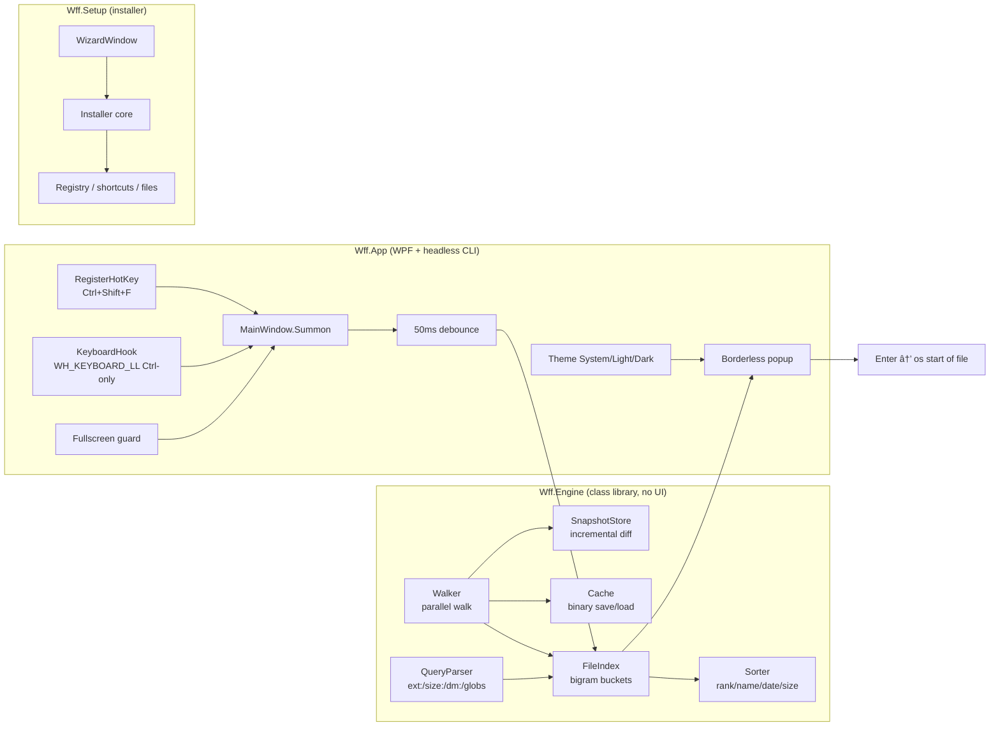

# ARCHITECTURE — win-fast-finder v1.0.1

How the shipped code is put together. Everything here describes what is
actually in `src/`; see [BUILDING](BUILDING.md) to run it and
[USAGE](USAGE.md) to drive it.

## Layout



Three projects, one solution:

| Project | Kind | Responsibility |
|---|---|---|
| `src/Wff.Engine` | Class library | Index, search, walk, cache, settings, parsing. **No UI, no WPF** — everything unit-testable. |
| `src/Wff.App` | WPF `WinExe` + headless CLI | Popup, hotkeys, theme, settings window, `--index`/`--query` mode. |
| `src/Wff.Setup` | WPF `WinExe` (UAC) | Install/uninstall wizard and silent flags; funnels through `Installer`. |
| `tests/Wff.Tests` | xunit | 62 tests over Engine + Setup. |

## Engine internals

**`Walker`** — parallel and sequential directory walks. Prunes blacklisted
names *before* descending, refuses to follow junctions/symlinks (reparse
points), and shuts down cleanly mid-walk. The parallel walker is asserted to
match the sequential one byte-for-byte in `ParallelWalkerTests`.

**`FileIndex`** — the speed core. Zero dependencies, purely in-memory:
1. `Build` lowercases each filename and emits every adjacent character pair
   (bigram) into a bucket keyed by that pair.
2. `Search` picks candidates by intersecting buckets (union-of-3 for gappy
   queries so "rb pdf" still finds `report.pdf`), applies cheap filters
   first — extension matching needs **no syscalls** — then subsequence-scores
   only the survivors and keeps a top-N heap.

It never scores all rows per keystroke. `MatchSpans` re-walks the *same*
greedy scoring path, so highlighted characters are exactly the scored ones.

**`QueryParser`** — whitespace tokens, case-insensitive:
- free text → subsequence score
- `ext:pdf` (repeatable → OR), `.pdf` accepted too
- `size:>1kb`, `size:<2mb`, `size:500kb` (`b/kb/mb/gb`)
- `dm:<7d` (within 7 days), `dm:>30d` (older), bare `dm:7d` = within
- any token containing `*` or `?` → `Glob` (iterative backtracking matcher,
  no `Regex` engine)
- bare token `path:` → also match against the full path instead of the name

Two documented sharp edges, by design: `path:` must be the **whole token**
(`path:` not `path:something`), and **there is no `sort:` token** — sorting is
a setting (`Settings.SortMode`), not query syntax.

**`Cache`** — binary blob: magic + version + count + length-prefixed UTF-8
paths, buffered 64 KB sequential IO. Loading validates magic and throws on
corruption rather than serving garbage; the app then rebuilds.

**`SnapshotStore` (`Incremental`)** — persists a per-root snapshot of
top-level child mtimes. On restart only children whose mtime changed are
re-walked; untouched subtrees keep their cached entries. `Resync` in Settings
forces a full rebuild.

**`Settings`** — JSON in `%APPDATA%\win-fast-finder\`, BCL only. Holds roots,
ignored drives/folders/extensions, hotkey strings, max results, sort mode,
theme, launch-at-login, hidden/system toggle. Corrupt files fall back to
safe defaults instead of crashing (see `ProdSettingsTests`).

## App internals

**Startup** — `App.OnStartup` creates a single-instance mutex
(`win-fast-finder-single`); a second launch shows a message and exits. It
then calls `MainWindow.EnsureReady()` directly rather than waiting for
`Loaded`, because a never-shown `Hidden` window may never raise it. All
startup failures land in the log file.

**Hotkeys**
| Trigger | Mechanism | Notes |
|---|---|---|
| Main hotkey (default `Ctrl+Shift+F`, user-configurable) | `RegisterHotKey` P/Invoke | No hook, no permissions, works from lock screen state changes. A modifier is required (`Hotkey` refuses bare keys). |
| `Ctrl` double-tap | `WH_KEYBOARD_LL` hook → `DoubleTapDetector` | The hook forwards **Ctrl press timestamps only**; it never records keystrokes, so there is no keylogging surface. Heuristic AV/SmartScreen hits are an accepted, documented cost — the app degrades to the main hotkey. |

**Summon path** — `Summon()` places the borderless window upper-centre of the
work area, `Show()`/`Activate()`/`Topmost = true`, clears the box and moves
caret focus via `Dispatcher` at `ApplicationIdle`. It is idempotent and
logged (`wm_hotkey received` → `summon enter` → post-show state) so "nothing
happens" is always diagnosable from `log.txt`.

**Fullscreen guard** — `Fullscreen.IsForegroundFullscreen()` returns true only
when the foreground window covers the whole work area **and** has no caption
(`WS_CAPTION` bit clear). A maximised Explorer/VS window is therefore *not*
treated as fullscreen; a borderless game or video is.

**Search UX** — `DispatcherTimer` debounces 50 ms, results carry a query id so
stale responses are dropped, only the top `MaxResults` (default 50) render.
`Deactivated` hides the popup unless a modal dialog owns focus. `Esc` hides,
`Enter` opens the selection (`OpenSelected`), double-click opens too.

**Headless** — `Wff.App --index <dir> [--query <q>]` walks, times, prints
`files=`, `query_ms=` and top hits. This is what the perf numbers below come
from and what CI-style proof uses.

## Speed contract

Budgets, measured on an i5 Windows host against a 700 k-file target:

| Path | Budget | Measured |
|---|---|---|
| Query over 100 k cached names | worst < 1000 ms | typical single-digit ms; 5 142-file tree → `query_ms=4` |
| Live profile (~304 k files) | — | first index ~37 s, queries ~6 ms |
| Incremental refresh on restart | < 5 s | ~8 s at 297 k files |
| Popup appear on hotkey | < 100 ms | instant (no index work on summon) |

Reproduce any of these with headless mode:

```powershell
dotnet run --project src/Wff.App -- --index "C:\Some\Big\Folder" --query "report"
```

Because it is a **filename** index (never file contents), the query path
allocates little and touches no syscalls during scoring.

## Privacy & threat model

- **No network code at all** — `HttpClient`, `WebRequest`, `TcpClient`,
  raw sockets: zero hits in `src/`. No telemetry, no update pings.
- **No admin required** at runtime. The installer elevates once (default
  `C:\Program Files`); the app itself runs as the user, reads no MFT,
  holds no elevated handles.
- **Blacklist skips sensitive trees** (`AppData`, `node_modules`, `.git`,
  `obj`, `bin`, `.vs` by default) and is user-extensible.
- **Keyboard hook is Ctrl-only** — see above.
- **Opens files via the shell** association only; the app never executes
  anything it indexes.
- Settings, cache and log live in `%APPDATA%\win-fast-finder\` — deleting
  that folder removes every trace. See [PRIVACY](PRIVACY.md).

## Testing ladder

| Level | What | Where |
|---|---|---|
| L0 | Compiles with 0 warnings / 0 errors | `dotnet build Wff.sln --no-incremental` |
| L1 | Unit tests, mutation-verified (red → green → flip the code → must fail) | `tests/Wff.Tests/*.cs` (27 files, 62 tests) |
| L2 | Real filesystem temp dirs, real walkers, real cache round-trip | `WalkerTests`, `CacheTests`, `IncrementalTests` |
| L3 | Journeys: headless index+query, installer validation, wizard rules | `StartupTests`, `WizardValidationTests` |
| L4 | Fresh clone, README commands run literally | see [BUILDING](BUILDING.md) |
| L5 | Adversarial: 10 k-char paths, unicode, null bytes, corrupt cache/settings | `AdversarialTests`, `ProdSettingsTests` |
| E2E | Synthetic `SendInput` Ctrl+Shift+F → visible window asserted | `tests/e2e/Invoke-WffE2E.ps1` |

Key suites: `FileIndex`/ranking (`IndexTests`, `FilterTests`,
`HighlightTests`, `PathSortTests`), hotkeys (`HotkeyParseTests`,
`DoubleTapTests`, `DoubleTapHoldTests`), ignore rules (`IgnoreOptionTests`,
`SafeDefaultTests`, `HiddenTests`), perf (`PerfTests`), setup
(`WizardValidationTests`, `RuntimeCheckTests`).

## Known limitations

1. **Installer is not code-signed** — SmartScreen/Defender may warn on
   first run. Documented, not hidden; see [SECURITY](../SECURITY.md).
2. **Cold walk is slower than Everything** — Everything uses a kernel
   driver and NTFS MFT reads; we stay non-admin and portable. The binary
   cache + incremental refresh make warm starts instant.
3. **Elevated-window hook limits (UIPI)** — a `WH_KEYBOARD_LL` hook cannot
   see keystrokes destined for an elevated window. `Ctrl+Shift+F`
   (`RegisterHotKey`) is unaffected.
4. **Single-machine tested** on Windows 10/11 x64 with the .NET 8 Desktop
   Runtime.
